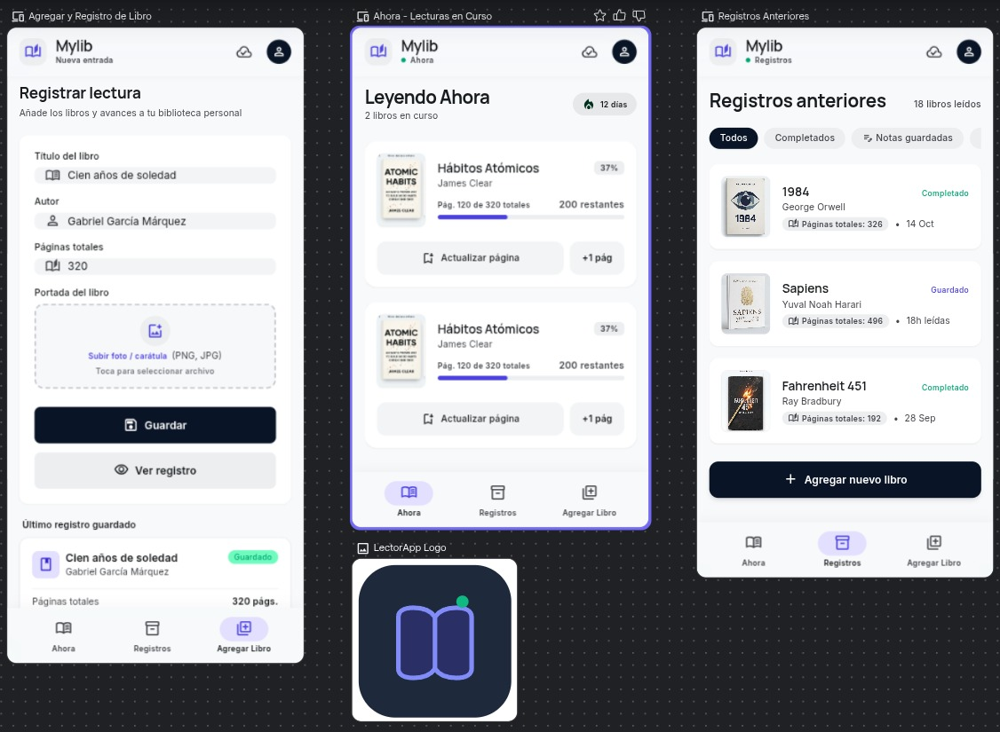

# MyLib
My first simple app to registry what book we are learning and registry the advance

## *Objetivo:*
Proporcionar un registro de los libros leidos y porcentaje de registros. Todo en una interfaz
## Funcionalidades:
- Agregar libros nuevos: Titulo, Autor, Número total de paginas
- Consultar registro de libros: Porcentaje de avance, ultima pagina leida
- Actualizar avance de libro: Registro de ultima pagina leida
- Consultar anteriores registros de libros terminados

## Desarrollo por fases

### Fase 1 - Pantalla de registro básica
- Composable con tres `OutlinedTextField`: título, autor y número de páginas.
- Botones **"Guardar"** y **"Ver registro"**.
- "Guardar" escribe los datos en el archivo `book_registry.txt` del almacenamiento interno
  usando `openFileOutput(FILENAME, Context.MODE_PRIVATE)`.
- "Ver registro" lee el archivo con `openFileInput`, lo muestra por consola con `Log.d`
  (etiqueta `BookStorage`) y también lo muestra en pantalla con un `Text`.

### Fase 2 - Navegación e interfaz multipantalla
- Barra de navegación inferior con tres pestañas: **Ahora**, **Registros** y **Agregar libro**.
- Pantalla "Ahora" con tarjetas de lecturas en curso (título, autor, porcentaje, barra de progreso).
- Pantalla "Registros" con historial y filtros (**Todos** / **Completados**).

### Fase 3 - Gestión de libros y avance
- Lista de libros persistida en `SharedPreferences` (se guarda automáticamente).
- Actualización del avance con botones `+` / `-` o escribiendo la página actual.
- Cálculo automático del porcentaje de avance y de páginas restantes.
- Un libro se marca como **Completado** al alcanzar el total de páginas.

### Fase 4 - Registros de libros terminados
- Los libros completados salen de "Ahora" y pasan a "Registros" con el estado **Completado**.
- Filtro **Completados** para consultar únicamente los libros terminados.
- Portadas de libro generadas con las iniciales del título.



## Estructura del código
```
app/src/main/java/com/example/helloworldcompose/
├── MainActivity.kt            # Actividad + navegación por pestañas
├── BookViewModel.kt           # Estado en memoria + persistencia
├── data/
│   ├── Book.kt                # Modelo de libro (progreso, %, paginas restantes)
│   └── BookStorage.kt         # openFileOutput/openFileInput + SharedPreferences
└── ui/
    ├── AddBookScreen.kt       # Fase 1: formulario + Guardar / Ver registro
    ├── CurrentReadsScreen.kt  # Lecturas en curso
    ├── HistoryScreen.kt       # Registros anteriores
    ├── ReadingCard.kt         # Tarjeta de avance con stepper de página
    └── theme/                 # Colores, tipografía y tema Material3
```